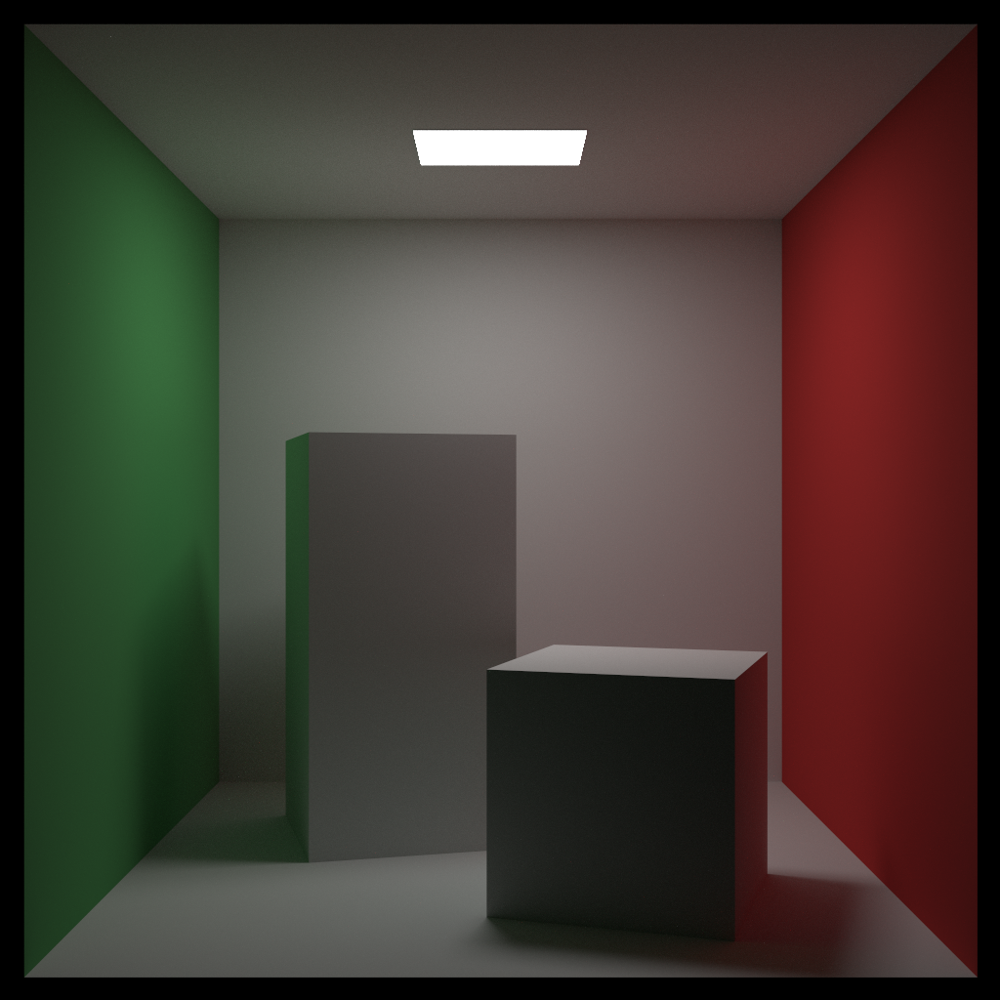

# Archicad Cornell Box

> A Cornell Box in Archicad in an attempt to standardize the comparison of interior renderings. 

You can download the [Archicad Plan Archive file](ac/Cornell%20Box.pla) (in EDU format) with a GDL scripted Cornell Box included.
Lights are notoriously hard to script, so I haven't scripted one for the time being. Instead I use the OOTB "Area Light 23". It is included in the `.pla`.

Rendered with the integrated CineRender in Archicad 23.  
Render time was `0:1:58` for 2400×1800 pixel.

| Reference Image | CineRender |
| --- | --- |
|  |  |

The reference image was taken from [_Dalamar42's_ raytracer](https://github.com/Dalamar42/rayt/).

To learn more about the Cornell Box see [here](https://www.graphics.cornell.edu/online/box/).

### Notes on the rendering scene
You can download the used scenery seperately [here](ac/runxel_viz_interior__v1.renderingscene).  
I'm using Irradiance Cache as primary method and Light Map as secondary method.
This system is especially good for interior scenes like the Cornell Box. It is _not_ suitable for outdoor renderings!  
As a rule of thumb:  
QMC+QMC is the most precise but also the slowest.  
A balanced method for outdoor renderings would be IR+QMC.  

Beware of using QMC + Irradiance Cache: The rendering result might be good, but you pay with dramatic render times. If you still attempt to render with this method set your sample rate really low (the number is multiplied internally).

## License
[BOML](LICENSE.md)

## See also:
- [Cornell Box in Blender](https://github.com/LucasReSilva/Cornell-Box)
- [Other scenes](https://www.janwalter.org/download/)
- [Bitterli's Rendering Research Resources](https://benedikt-bitterli.me/resources/)
